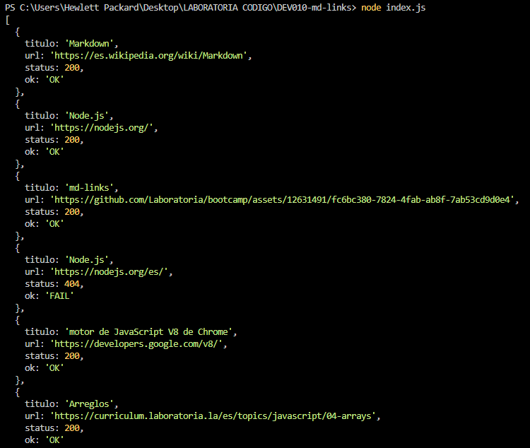
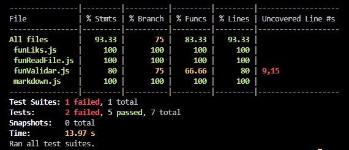

# md-links

## Descripción

`md-links` es una librería desarrollada en Node.js que tiene como objetivo analizar archivos Markdown en busca de enlaces (links) y reportar estadísticas relacionadas con ellos. La herramienta funciona mediante una función `mdLinks` que devuelve una promesa con los enlaces encontrados en el archivo Markdown especificado.

## Uso

Para utilizar esta librería, sigue estos pasos:

1. Clona este repositorio en tu entorno local.
2. Instala las dependencias utilizando `npm install`.
3. Ejecuta el comando `node index.js` seguido de la ruta de tu archivo Markdown para obtener los enlaces encontrados.

## Estructura del Código

### Funciones Principales

- `mdLinks(filePath)`: Extrae los enlaces de un archivo Markdown. Utiliza funciones como `fReadFile` para leer archivos, `isMdwnExtension` para verificar la extensión y otras funciones internas para validar los enlaces.
- `fReadFile(readFile)`: Lee el contenido de un archivo de manera asincrónica.
- `links(contenido)`: Extrae los enlaces encontrados en el contenido del archivo Markdown.
- `fValidar(link)`: Realiza validaciones de los enlaces, como verificar su estado (OK o FAIL) y su código de status.

### Microfunciones

- `isMdwnExtension(filePath)`: Verifica si la extensión del archivo es de tipo Markdown.

## Tests

### Funciones Principales

- `isMdwnExtension`: Verifica si la ruta proporcionada es un archivo con extensión .md.
- `fReadFile`: Prueba la lectura del contenido de un archivo y su funcionamiento en distintos escenarios.
- `links`: Valida la función que extrae enlaces y su comportamiento con distintos tipos de texto.
- `fValidar`: Testea la función de validación de enlaces y su capacidad para obtener el estado de los mismos.

## Resultado Final

El proyecto ha permitido crear una herramienta funcional para el análisis de enlaces en archivos Markdown. La librería proporciona una interfaz que puede ser utilizada tanto programáticamente como desde la línea de comandos, brindando información relevante sobre los enlaces presentes en los archivos.

### Resultado de los Tests

Los tests han sido ejecutados exitosamente y cubren una amplia variedad de situaciones, validando el correcto funcionamiento de las funciones principales de la librería.

